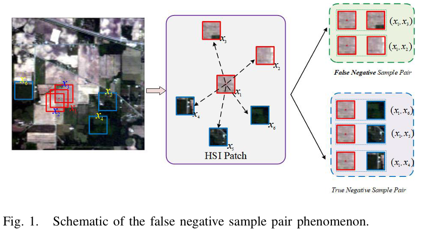
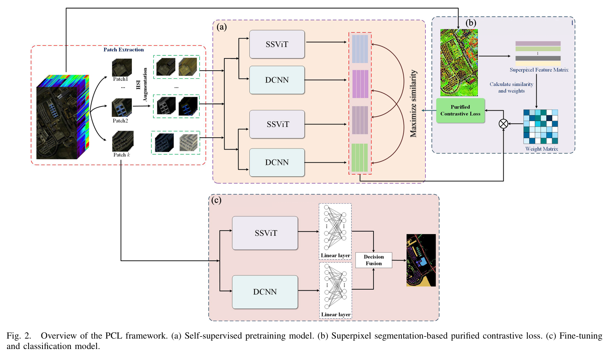
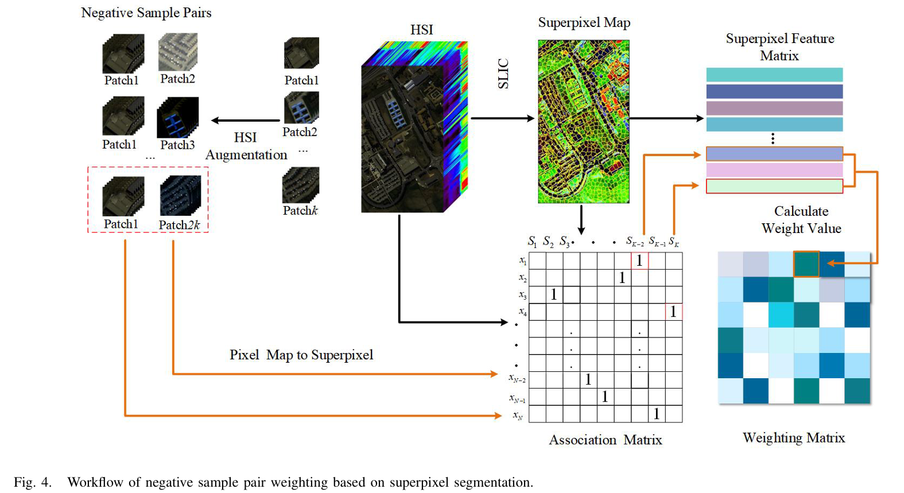

### Purified Contrastive Learning with Global and Local Representation for Hyperspectral Image Classification

<font color='#88CDF6'>Lin Zhao; Jia Li; Wenqiang Luo; Er Ouyang; Jianhui Wu; Guoyun Zhang; Wujin Li</font>

<hr>
The code in this toolbox implements the

["Purified Contrastive Learning With Global and Local Representation for Hyperspectral Image Classification"](https://ieeexplore.ieee.org/document/10547362)

As illustrated in Fig. 1, spatially adjacent patches exhibit substantial overlap across large areas, resulting in remarkably high similarity. Consequently, this leads to an increased number of negative sample pairs with exceedingly high similarity, referred to as “false negative sample pairs.” These false negative sample pairs pose a challenge to the contrastive learning paradigm, which aims to learn representations by bringing positive samples closer while simultaneously pushing negatives farther apart. 




The proposed method is detailed as follow.



The core of the framework design lies in weighting the loss of contrast between samples based on the similarity of superpixels.




### System-Spefic notes:

The experimental computer setup includes an Intel(R)
Core(TM) i7-10700F processor, an NVIDIA GeForce RTX 2060 SUPER graphics card, and Python version 3.8.5 and PyTorch version 1.7.1 as the programming language and deep
learning platform, respectively.

<hr>

### How to use it?
First, running the `pretrain_main.py` to pretrain the model, This operation will get a weight folder. Running the `finetune.py` then, you will achieve the final results.


<hr>

### Citation
**Please kindly cite the papers if this code is useful and helpful for your research.**
```
@ARTICLE{9734031,
@article{zhao2024purified,
  title={Purified contrastive learning with global and local representation for hyperspectral image classification},
  author={Zhao, Lin and Li, Jia and Luo, Wenqiang and Ouyang, Er and Wu, Jianhui and Zhang, Guoyun and Li, Wujin},
  journal={IEEE Transactions on Geoscience and Remote Sensing},
  volume={62},
  pages={1--14},
  year={2024},
  publisher={IEEE}
}
```
<hr>

### Licensing
Copyright (C) 2022 Lin Zhao

This program is distributed in the hope that it will be useful, but WITHOUT ANY WARRANTY; without even the implied warranty of MERCHANTABILITY or FITNESS FOR A PARTICULAR PURPOSE. See the GNU General Public License for more details.

You should have received a copy of the GNU General Public License along with this program.


